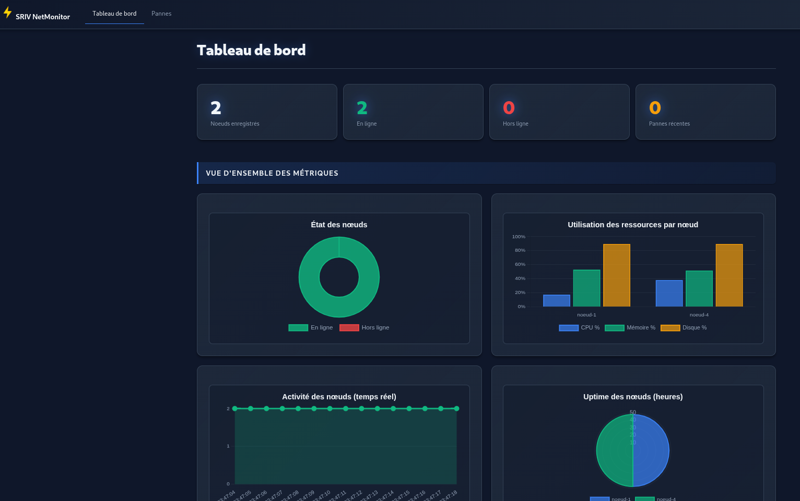
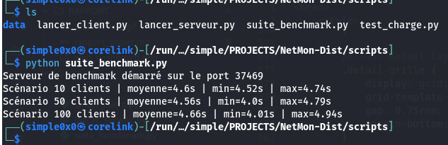

## Introduction

La supervision des systèmes informatiques est une composante critique de l'administration réseau moderne. Elle permet de garantir la disponibilité, la performance et la sécurité des infrastructures distribuées. Des systèmes de supervision reconnus tels que Nagios, Zabbix ou Prometheus offrent des solutions robustes pour surveiller des parcs de serveurs, mais leur complexité peut être importante. Dans ce contexte, ce projet a pour objectif pédagogique de concevoir et d'implémenter un système de supervision distribué simplifié, mais fonctionnel, basé sur une architecture client-serveur en Python. L'enjeu est de mettre en pratique les concepts fondamentaux des systèmes répartis, notamment la programmation réseau avec sockets TCP, la gestion de la concurrence à l'aide de pools de threads, la conception d'un protocole applicatif et l'accès concurrent à une base de données. Ce rapport présente en détail l'architecture du système, les choix techniques effectués, le protocole de communication, les mécanismes de gestion de la concurrence, la persistance des données, les résultats des tests de charge, ainsi que les limites du système et les améliorations possibles.

## Architecture du système

Le système est structuré selon une architecture client-serveur classique, composée d'agents de supervision (clients) déployés sur les machines à surveiller et d'un serveur central qui collecte, stocke et présente les données.

> [!NOTE]
> Le schéma ci-dessous illustre l'architecture globale du système, montrant l'interaction entre les agents, le serveur central, la base de données et l'interface web.


### L'agent de supervision

L'agent, implémenté dans la classe `AgentSupervision`, est un processus léger qui s'exécute en arrière-plan sur chaque nœud supervisé. Son rôle est de collecter périodiquement des métriques et de les envoyer au serveur. Il s'appuie sur le `CollecteurMetriques` pour la collecte des données et le `GestionnaireServices` pour la gestion des commandes.

L'initialisation de l'agent montre clairement l'agrégation de ses composants :

```python
# @/run/media/simple0x0/simple/PROJECTS/NetMon-Dist/src/supervision_distribuee/client/agent.py:21-46
class AgentSupervision:
    def __init__(
        self,
        node_id: str,
        server_host: str,
        server_port: int,
        metrics_interval: float,
        retry_delay: float,
        managed_services: list[str],
        public_apps: dict[str, list[str]],
        monitored_ports: list[int],
        simulate: bool = False,
    ) -> None:
        self.node_id = node_id
        self.server_host = server_host
        self.server_port = server_port
        self.intervalle_metriques = metrics_interval
        self.delai_reconnexion = retry_delay
        self.gestionnaire_services = GestionnaireServices(managed_services)
        self.collecteur = CollecteurMetriques(
            node_id=node_id,
            applications_publiques=public_apps,
            ports_surveilles=monitored_ports,
            etats_services_geres=self.gestionnaire_services.snapshot(),
            simuler=simulate,
        )
```

### Le serveur central

Le serveur, encapsulé dans la classe `ServeurSupervision`, est le cœur du système. Il est multi-clients et utilise un `ThreadPoolExecutor` pour gérer les connexions simultanées. Il valide les messages, met à jour le registre des nœuds (`RegistreNoeuds`) et persiste les données via le `DepotSupervision`.

```python
# @/run/media/simple0x0/simple/PROJECTS/NetMon-Dist/src/supervision_distribuee/serveur/service.py:26-45
class ServeurSupervision:
    def __init__(
        self,
        host: str,
        port: int,
        db_path: str | Path,
        worker_pool_size: int,
        db_pool_size: int,
        client_timeout: float,
        failure_scan_interval: float,
    ) -> None:
        self.host = host
        self.port = port
        self.timeout_client = client_timeout
        self.intervalle_scan_panne = failure_scan_interval
        self.registre = RegistreNoeuds()
        self.pool_bd = PoolConnexionsSQLite(chemin_bd=db_path, taille_pool=db_pool_size)
        self.depot = DepotSupervision(self.pool_bd)
        self.pool_threads = ThreadPoolExecutor(max_workers=worker_pool_size, thread_name_prefix="handler-client")
```

### L'interface web

Le système propose une interface web développée avec Flask pour la consultation des données. Elle permet de visualiser un tableau de bord global, le détail de chaque nœud, et les pannes récentes, avec un rafraîchissement automatique pour une vue en quasi temps réel.

> [!INFO]
> L'image suivante est une capture d'écran du tableau de bord de l'interface web, affichant l'état des nœuds supervisés.



## Choix techniques

- **Python** : Choisi pour sa simplicité, sa lisibilité et son écosystème riche (`socket`, `concurrent.futures`).
- **SQLite** : Préféré pour sa légèreté et sa facilité de déploiement, idéal pour un projet académique.
- **Flask** : Utilisé pour sa légèreté et sa flexibilité, permettant de créer rapidement une interface de visualisation.
- **psutil** : Utilisé pour la collecte des métriques système réelles. Le système intègre une alternative de simulation pour garantir la portabilité.

> [!INFO]
> La bascule entre la collecte réelle et simulée est gérée dynamiquement, comme le montre ce snippet. Si `psutil` n'est pas installé, le collecteur passe automatiquement en mode simulé.

```python
# @/run/media/simple0x0/simple/PROJECTS/NetMon-Dist/src/supervision_distribuee/client/collecteur.py:42-51
    def collecter(self) -> RapportMetriques:
        if self.simuler:
            return self._collecter_simule()
        if psutil is None:
            LOGGER.warning(
                "psutil indisponible, bascule en métriques simulées pour %s",
                self.node_id,
            )
            return self._collecter_simule()
        return self._collecter_reel()
```

## Protocole de communication

Le protocole est basé sur l'échange de messages JSON ligne par ligne sur TCP. La validation est strictement appliquée côté serveur via la fonction `valider_message`.

```python
# @/run/media/simple0x0/simple/PROJECTS/NetMon-Dist/src/supervision_distribuee/common/protocole.py:50-55
def valider_message(message: dict[str, Any]) -> None:
    if not isinstance(message, dict):
        raise ErreurProtocole("Le message doit être un objet JSON")
    type_message = message.get("type")
    if not isinstance(type_message, str):
        raise ErreurProtocole("Le champ type est obligatoire")
```

Les principaux types de messages sont :

- **`metrics_report`** : Envoyé par l'agent avec les métriques collectées.
  ```json
  {
  "type": "metrics_report",
  "node_id": "noeud-1",
  "timestamp": "2026-03-12T18:00:00Z",
  "os_name": "Windows-10",
  "cpu_model": "Intel_i7",
  "cpu_percent": 25.5,
  "memory_percent": 60.1,
  "disk_percent": 45.8,
  "uptime_seconds": 7200,
  "services": {
    "sshd": "active"
  },
  "ports": {
    "80": "open"
  },
  "alerts": []
}

  ```
- **`command`** : Envoyé par le serveur pour exécuter une action (ex: `UP`).
- **`command_result`** : Réponse de l'agent à une commande.
- **`ack`** et **`error`** : Accusés de réception ou rapports d'erreur.

## Gestion de la concurrence

### Pool de threads pour les clients

Un `ThreadPoolExecutor` gère les connexions clientes, limitant la consommation de ressources et la latence liée à la création de threads.

```python
# @/run/media/simple0x0/simple/PROJECTS/NetMon-Dist/src/supervision_distribuee/serveur/service.py:130-131
            socket_client.settimeout(1.0)
            self.pool_threads.submit(self._gerer_connexion_client, socket_client, adresse)
```

### Pool de connexions pour la base de données

Pour éviter les erreurs "database is locked", un pool de connexions basé sur `queue.Queue` sérialise l'accès à la base de données SQLite.

```python
# @/run/media/simple0x0/simple/PROJECTS/NetMon-Dist/src/supervision_distribuee/serveur/base_de_donnees.py:12-26
class PoolConnexionsSQLite:
    def __init__(self, chemin_bd: str | Path, taille_pool: int = 5) -> None:
        self.chemin_bd = Path(chemin_bd)
        creer_dossier_parent(self.chemin_bd)
        self.taille_pool = taille_pool
        self._pool: Queue[sqlite3.Connection] = Queue(maxsize=taille_pool)
        self._connexions: list[sqlite3.Connection] = []
        for _ in range(taille_pool):
            connexion = sqlite3.connect(self.chemin_bd, check_same_thread=False)
            connexion.row_factory = sqlite3.Row
            connexion.execute("PRAGMA journal_mode=WAL")
            connexion.execute("PRAGMA foreign_keys=ON")
            self._connexions.append(connexion)
            self._pool.put(connexion)
        self._initialiser_schema()
```

## Stockage et journalisation

Les données sont stockées dans une base de données SQLite avec quatre tables principales, dont le schéma est créé au démarrage du serveur.

```sql
-- @/run/media/simple0x0/simple/PROJECTS/NetMon-Dist/src/supervision_distribuee/serveur/base_de_donnees.py:32-75
CREATE TABLE IF NOT EXISTS etat_noeud (
    node_id TEXT PRIMARY KEY,
    os_name TEXT NOT NULL,
    cpu_model TEXT NOT NULL,
    dernier_contact TEXT NOT NULL,
    statut TEXT NOT NULL,
    dernier_payload_json TEXT NOT NULL
);

CREATE TABLE IF NOT EXISTS metriques (
    id INTEGER PRIMARY KEY AUTOINCREMENT,
    node_id TEXT NOT NULL,
    horodatage TEXT NOT NULL,
    cpu_percent REAL NOT NULL,
    memory_percent REAL NOT NULL,
    disk_percent REAL NOT NULL,
    uptime_seconds INTEGER NOT NULL,
    os_name TEXT NOT NULL,
    cpu_model TEXT NOT NULL,
    services_json TEXT NOT NULL,
    ports_json TEXT NOT NULL,
    alertes_json TEXT NOT NULL,
    recu_le TEXT NOT NULL
);

CREATE TABLE IF NOT EXISTS evenements (
    id INTEGER PRIMARY KEY AUTOINCREMENT,
    node_id TEXT NOT NULL,
    type_evenement TEXT NOT NULL,
    message TEXT NOT NULL,
    cree_le TEXT NOT NULL
);

CREATE TABLE IF NOT EXISTS commandes (
    id INTEGER PRIMARY KEY AUTOINCREMENT,
    node_id TEXT NOT NULL,
    nom_commande TEXT NOT NULL,
    nom_service TEXT NOT NULL,
    statut TEXT NOT NULL,
    message_reponse TEXT,
    cree_le TEXT NOT NULL,
    mis_a_jour_le TEXT NOT NULL
);
```

- **`etat_noeud`** : Stocke l'état le plus récent de chaque nœud.
- **`metriques`** : Contient l'historique détaillé des métriques pour l'analyse des tendances.
- **`evenements`** : Journalise les événements importants (alertes, pannes).
- **`commandes`** : Trace les commandes envoyées aux agents.

## Résultats expérimentaux

Les tests de charge, exécutés avec le script `suite_benchmark.py`, ont évalué la performance du serveur face à 10, 50 et 100 clients simultanés.

> [!INFO]
> L'image ci-dessous montre la sortie du script de benchmark lors de son exécution.



Les résultats obtenus sont les suivants :

- **10 clients** : durée moyenne de 4.92 secondes.
- **50 clients** : durée moyenne de 4.65 secondes.
- **100 clients** : durée moyenne de 4.63 secondes.

L'analyse montre que le serveur a traité la charge sans défaillance et que la durée moyenne d'exécution n'a pas augmenté avec le nombre de clients, validant l'efficacité de l'architecture concurrente.

## Limites et améliorations possibles

- **Sécurité** : L'absence de chiffrement (TLS) et d'authentification des agents constitue une vulnérabilité majeure.
- **Scalabilité de la base de données** : SQLite limite la scalabilité en écriture ; une migration vers PostgreSQL serait bénéfique pour des déploiements plus larges.
- **Activation des services** : L'activation des services est actuellement logique et non réelle.
- **Système d'alertes** : Les alertes sont journalisées mais ne déclenchent pas de notifications externes (email, SMS).

## Conclusion

Ce projet a permis d'atteindre les objectifs pédagogiques en réalisant un système de supervision distribué fonctionnel. Les défis, notamment la gestion de la concurrence, ont été surmontés avec succès. Le système actuel, bien que présentant des limites, constitue une base solide et démontre la maîtrise des concepts clés des systèmes répartis, ouvrant la voie à des évolutions futures vers un outil plus robuste.

## Bibliographie et webographie

- Documentation officielle de Python. [En ligne]. Disponible sur : https://docs.python.org/3/
- Documentation de la bibliothèque `socket`. [En ligne]. Disponible sur : https://docs.python.org/3/library/socket.html
- Documentation de la bibliothèque `concurrent.futures`. [En ligne]. Disponible sur : https://docs.python.org/3/library/concurrent.futures.html
- Documentation de la bibliothèque `psutil`. [En ligne]. Disponible sur : https://psutil.readthedocs.io/
- Documentation de Flask. [En ligne]. Disponible sur : https://flask.palletsprojects.com/
- Documentation de SQLite. [En ligne]. Disponible sur : https://www.sqlite.org/docs.html
- Site officiel de Nagios. [En ligne]. Disponible sur : https://www.nagios.org/
- Site officiel de Zabbix. [En ligne]. Disponible sur : https://www.zabbix.com/
- Site officiel de Prometheus. [En ligne]. Disponible sur : https://prometheus.io/
