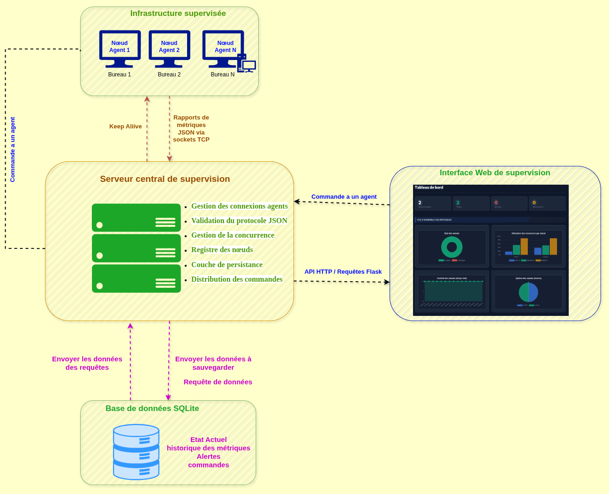
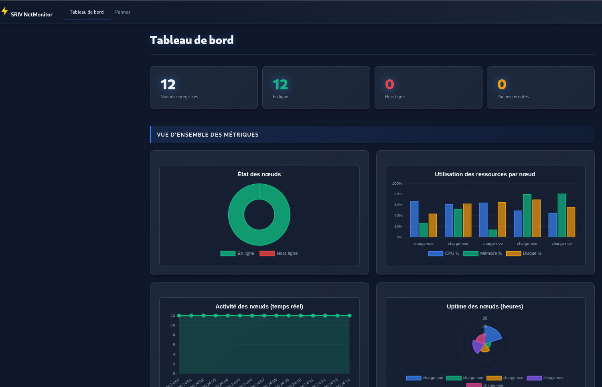

# NetMon-Dist

# Système distribué de supervision réseau

Projet de Systèmes Répartis réalisé en Python, basé sur une architecture client-serveur avec sockets TCP.

## Membres du groupe

- Abdallah NDIAYE - [LayeSec006]
- Mouhamadou Lamine Bamba Thiam - [rootlamine]
- Azubuike Daniel EZEADIM - [azudan, Simple0x0]

## Fonctionnalités

- agents de supervision TCP envoyant périodiquement des métriques au serveur
- serveur multi-clients avec pool de threads
- base SQLite avec pool de connexions
- protocole applicatif JSON validé côté serveur
- journalisation des alertes et des pannes
- détection de panne après délai configurable
- interface CLI d'administration côté serveur
- interface web d'administration (Flask)
- commande `UP` envoyée du serveur vers un client
- client et serveur séparés, déployables sur des machines différentes
- script de test de charge pour 10, 50 et 100 clients
- tests unitaires et test d'intégration

## Architecture

- `src/supervision_distribuee/client/` : agent de supervision
- `src/supervision_distribuee/serveur/` : serveur, stockage, registre des clients, interface web
- `src/supervision_distribuee/common/` : protocole, modèles, utilitaires
- `scripts/` : lancement serveur/client et test de charge
- `tests/` : tests automatisés
- `docs/` : architecture, plan Git et guide de rapport

## Protocole applicatif

Le protocole utilise des messages JSON terminés par un retour à la ligne.

Types de messages :

- `metrics_report`
- `command`
- `command_result`
- `ack`
- `error`

## Installation

```bash
python -m venv .venv
.venv\Scripts\activate
python -m pip install -r requirements.txt
```

## Lancer le serveur

```bash
python scripts/lancer_serveur.py --host 0.0.0.0 --port 9000 --db data/supervision.db
```

### Avec l'interface web

```bash
python scripts/lancer_serveur.py --host 0.0.0.0 --port 9000 --web --web-port 8080
```

L'interface web est accessible à l'adresse `http://<IP_DU_SERVEUR>:8080`.

Commandes CLI du serveur :

- `aide`
- `liste`
- `detail <node_id>`
- `historique <node_id> [limite]`
- `envoyer <node_id> UP <nom_service>`
- `pannes`
- `quitter`

## Lancer un client

```bash
# En local (même machine que le serveur)
python scripts/lancer_client.py --node-id noeud-1 --server-host 127.0.0.1 --server-port 9000

# Depuis un autre ordinateur du réseau
python scripts/lancer_client.py --node-id noeud-2 --server-host 192.168.1.100 --server-port 9000

# Avec métriques simulées (sans psutil)
python scripts/lancer_client.py --node-id noeud-3 --server-host 192.168.1.100 --server-port 9000 --simulate
```

## Test de charge

```bash
python scripts/test_charge.py --host 127.0.0.1 --port 9000 --clients 10 --duration 8
python scripts/test_charge.py --host 127.0.0.1 --port 9000 --clients 50 --duration 8
python scripts/test_charge.py --host 127.0.0.1 --port 9000 --clients 100 --duration 8
python scripts/suite_benchmark.py
```

`suite_benchmark.py` démarre automatiquement un serveur local temporaire, exécute les scénarios 10, 50 et 100 clients, puis s'arrête proprement.

## Tests automatisés

```bash
└─$ python test_charge.py --host 127.0.0.1 --port 9000 --clients 10 --duration 8
Clients lancés : 10
Durée moyenne observée : 8.36s
Durée max observée : 10.41s
Durée min observée : 8.00s
```

## Choix techniques

- `ThreadPoolExecutor` pour le serveur multi-clients
- SQLite pour rester simple à déployer et facile à expliquer
- pool de connexions maison basé sur `queue.Queue`
- collecte réelle via `psutil` quand disponible, sinon simulation contrôlée
- commande `UP` gérée côté agent pour activer un service supervisé logique
